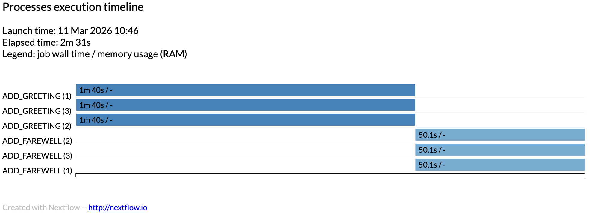

# nextflow-lsf-tiny
Tiny test of nextflow + LSF

Reuse St Jude executor config: https://nf-co.re/configs/stjude/

**Local Run**

```bash
nextflow run main.nf --infiles "data/*.txt" -with-timeline timeline.html
```

Which prints out:

```bash

 N E X T F L O W   ~  version 25.10.4

Launching `main.nf` [magical_torvalds] DSL2 - revision: 53b80e830e

executor >  local (6)
[bd/a77495] ADD_GREETING (3) [100%] 3 of 3 ✔
[5c/77e054] ADD_FAREWELL (2) [100%] 3 of 3 ✔
/Users/jchang99/github/j23414/nextflow-lsf-tiny/work/06/c746a151f3a2946dcd535d4fb7d28a/charlie.txt_greeting.txt_letter.txt
/Users/jchang99/github/j23414/nextflow-lsf-tiny/work/06/8666d72d9abb161a22e6d18482d0bc/alice.txt_greeting.txt_letter.txt
/Users/jchang99/github/j23414/nextflow-lsf-tiny/work/5c/77e0547b58023dd161933a0652d749/bob.txt_greeting.txt_letter.txt

Completed at: 11-Mar-2026 10:49:02
Duration    : 2m 31s
CPU hours   : 0.1
Succeeded   : 6
```

**timeline.html**



**LSF HPC Run**

```bash
nextflow run main.nf --infiles "data/*.txt" -with-timeline timeline.html -profile stjude
```